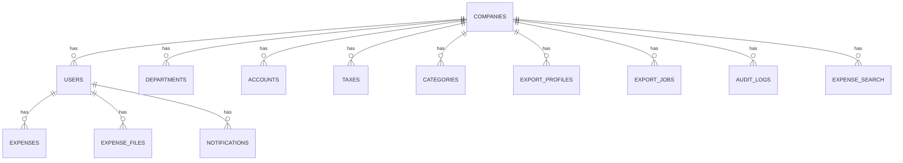
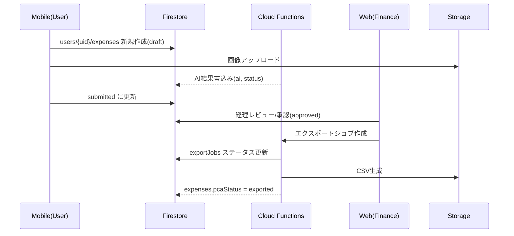

# Firestore データ構成（入れ子スタイル × RBAC）

本書は、Firebase/Firestore を用いた経費精算アプリのデータ構成を示します。個人データはユーザー配下に入れ子で管理し、管理者/経理は会社配下の集約ビューを参照します。PCAと整合するマスタは会社配下に保持します。

---

## 1. 原則・前提
- **入れ子構造**: 個人起因データは `companies/{companyId}/users/{userId}/...` 配下。
- **PCAを正マスタ**: 勘定科目/税区分/部門は PCA コード基準で会社配下に保持。
- **RBAC**: `staff / manager / finance / admin`。Custom Claims で `role, companyId, departmentId` を付与。
- **集約ビュー**: 経理/管理者の横断閲覧用に、会社配下へ検索用コレクションを非正規化（Functionsが同期）。
- **監査性**: 重要操作は `auditLogs` に冪等記録。過去伝票の整合用にスナップショットを保持。

---

## 2. ハイレベル構造図（Mermaid）
```mermaid
flowchart TD
  A[companies/{companyId}] --> A1[users/{userId}]
  A1 --> A1a[profile]
  A1 --> A1b[expenses/{expenseId}]
  A1 --> A1c[expense_files/{expenseId}/{fileId}]
  A1 --> A1d[notifications/{notificationId}]

  A --> B1[departments/{deptCode}]
  A --> B2[accounts/{pcaCode}]
  A --> B3[taxes/{pcaTaxCode}]
  A --> B4[categories/{categoryId}]
  A --> B5[exportProfiles/{profileId}]
  A --> B6[exportJobs/{jobId}]
  A --> B7[auditLogs/{logId}]

  %% 集約ビュー（検索用）
  A --> C1[expense_search/{expenseId}]
```

### 2.1 エンティティ関係（ER図）

- 主キー: `accounts.pcaCode`, `taxes.pcaTaxCode`, `departments.deptCode`
- 個人データは `users/{userId}` 配下で完結。検索は `expense_search` を利用。

### 2.2 提出〜承認〜エクスポートのデータフロー

- `expense_search` は Functions が随時同期。

### 2.3 アクセス制御（概念図）
```mermaid
flowchart LR
  Staff[staff(本人)] -- read/write --> UExp[users/{uid}/expenses]
  Staff -- read/write --> UFiles[users/{uid}/expense_files]
  Manager[manager] -- read --> Search[expense_search]
  Finance[finance] -- read --> Search
  Admin[admin] -- read --> Search
  Finance -- read/write --> Masters[accounts/taxes/departments/categories]
  Admin -- read/write --> Masters
  Functions[Functions] -- write(sync) --> Search
```
- 集約 `expense_search` は閲覧のみ。更新はサーバ側。

---

## 3. コレクション詳細

### 3.1 会社
- `companies/{companyId}`
  - `name`: string
  - `createdAt`: timestamp
  - `isActive`: boolean

### 3.2 ユーザー配下（個人データ）
- `companies/{companyId}/users/{userId}`
  - `email`, `name`, `role`: 'staff'|'manager'|'finance'|'admin'
  - `departmentId`: string (部門コード)
  - `createdAt`, `updatedAt`

- `.../profile`
  - `displayName`, `phone`, `settings`: { locale, currency, notifications }

- `.../expenses/{expenseId}`
  - `status`: 'draft'|'submitted'|'approved'|'rejected'|'exported'
  - `type`: 'receipt'|'travel'|'invoice'
  - `currency`: 'JPY' など
  - `total`, `tax`, `subtotal`, `taxRate`: number
  - `paidAt`: timestamp / date-string
  - `merchant`, `categoryId`, `note`
  - `departmentId`: string（提出時点）
  - `ai`: { engine: 'docai'|'gemini', confidence: number, rawJsonRef }
  - `duplicateIds`: string[]
  - `approverId`, `approvedAt`, `rejectedReason`
  - `pcaStatus`: 'pending'|'exported'|'error', `pcaJournalId`, `exportAt`
  - `accountSnapshot`: { `pcaCode`, `name`, `taxCode`, `rate` }
  - `createdAt`, `updatedAt`

- `.../expense_files/{expenseId}/{fileId}`
  - `gcsPath`, `page`, `pageCount`, `ocrStatus`, `uploadedAt`

- `.../notifications/{notificationId}`
  - `type`: 'submit'|'reject'|'approve'|'exported'|...
  - `payload`: object
  - `readAt`, `createdAt`

### 3.3 マスタ（PCA起点・会社配下）
- `companies/{companyId}/departments/{deptCode}`
  - `pcaDeptCode`(=docId), `name`, `parentCode?`, `isActive`
  - `effectiveFrom`, `effectiveTo?`

- `companies/{companyId}/accounts/{pcaCode}`
  - `pcaCode`(=docId), `name`, `taxCode`, `isActive`
  - `effectiveFrom`, `effectiveTo?`, `aliases`: string[]

- `companies/{companyId}/taxes/{pcaTaxCode}`
  - `pcaTaxCode`(=docId), `rate`, `rounding`: 'round'|'ceil'|'floor'
  - `method`: 'exclusive'|'inclusive', `isActive`
  - `effectiveFrom`, `effectiveTo?`

- `companies/{companyId}/categories/{categoryId}`
  - `name`, `defaultDebitAccountPcaCode`, `defaultCreditAccountPcaCode`
  - `taxRule`, `hints`: string[]

- `companies/{companyId}/exportProfiles/{profileId}`
  - `name`: 'PCA'
  - `encoding`: 'Shift_JIS'|'UTF-8', `delimiter`: ','|'\t'
  - `dateFormat`: 'YYYY/MM/DD'
  - `mappingJson`: object（列マッピング）

- `companies/{companyId}/exportJobs/{jobId}`
  - `filters`: { periodFrom, periodTo, departments[], status[] }
  - `status`: 'running'|'done'|'error', `filePath`, `summary`
  - `createdBy`, `createdAt`, `finishedAt?`

- `companies/{companyId}/auditLogs/{logId}`
  - `actorId`, `action`, `targetPath`, `before`, `after`, `at`

### 3.4 集約ビュー（検索用・非正規化）
- `companies/{companyId}/expense_search/{expenseId}`
  - `userId`, `departmentId`, `status`, `paidAt`, `total`, `currency`
  - `merchant`, `categoryId`, `pcaStatus`
  - `createdAt`, `updatedAt`
  - 備考: Functions が `users/*/expenses/*` の変更をフックして同期。管理/経理のクエリを高速化。

---

## 4. 例: expense ドキュメント
```json
{
  "status": "submitted",
  "type": "receipt",
  "currency": "JPY",
  "total": 15000,
  "tax": 1364,
  "subtotal": 13636,
  "taxRate": 0.1,
  "paidAt": "2025-08-20",
  "merchant": "JR東日本",
  "categoryId": "travel",
  "departmentId": "D0101",
  "ai": { "engine": "docai", "confidence": 0.92, "rawJsonRef": "gs://.../raw.json" },
  "duplicateIds": [],
  "pcaStatus": "pending",
  "accountSnapshot": { "pcaCode": "6001", "name": "旅費交通費", "taxCode": "課税10", "rate": 0.1 },
  "createdAt": 1692523200,
  "updatedAt": 1692523200
}
```

---

## 5. セキュリティルール（概念）
> 実装は `Custom Claims` に `role, companyId, departmentId` を付与して前提化。

```js
match /databases/{database}/documents {
  function isCompanyMember(companyId) {
    return request.auth != null && request.auth.token.companyId == companyId;
  }
  function hasRole(role) {
    return request.auth != null && request.auth.token.role == role;
  }

  // 個人データ: 自分のみ読み書き可（ドラフト編集可）。
  match /companies/{companyId}/users/{userId}/expenses/{expenseId} {
    allow read, create: if isCompanyMember(companyId) && request.auth.uid == userId;
    allow update: if isCompanyMember(companyId) && request.auth.uid == userId && resource.data.status == 'draft';
  }

  // ファイル参照も同様に本人のみ
  match /companies/{companyId}/users/{userId}/expense_files/{expenseId}/{fileId} {
    allow read, write: if isCompanyMember(companyId) && request.auth.uid == userId;
  }

  // 集約ビュー: 閲覧は manager/finance、書き込みはサーバ（Functions 経由のみ）
  match /companies/{companyId}/expense_search/{expenseId} {
    allow read: if isCompanyMember(companyId) && (hasRole('manager') || hasRole('finance') || hasRole('admin'));
    allow write: if false; // Admin SDK 経由でのみ更新
  }

  // マスタ: 閲覧は社内全員、更新は finance/admin
  match /companies/{companyId}/{collectionName}/{docId} \
    where collectionName in ['departments','accounts','taxes','categories','exportProfiles','exportJobs','auditLogs'] {
    allow read: if isCompanyMember(companyId);
    allow create, update, delete: if isCompanyMember(companyId) && (hasRole('finance') || hasRole('admin'));
  }
}
```

---

## 6. インデックス推奨（例）
- Collection Group `expenses`（`users/*/expenses/*`）
  - `companyId+status+paidAt(desc)`
  - `departmentId+paidAt`
  - `userId+status`
- `expense_search`
  - `status+paidAt(desc)`、`departmentId+paidAt`、`pcaStatus+updatedAt`

---

## 7. 命名・キー設計
- マスタ（PCA起点）は **コードを docId** に使用（`accounts/{pcaCode}` 等）。
- それ以外は `auto-ID` を基本に、再生成/非同期衝突を回避。
- タイムスタンプは `createdAt/updatedAt` を ISO もしくは Firestore Timestamp で統一。

---

## 8. 同期と運用
- PCA マスタは CSV 取込（ドライラン→承認→適用）。
- 取込後に Functions が `expense_search` を再計算し、未マッピングや非活性参照を検知してレポート。
- エクスポートは `exportJobs` に履歴・再出力可否・サマリを保持。

---

## 9. データ保持/削除（例）
- ドラフト: 90日未更新で自動削除（通知あり）
- 差戻し: 180日でアーカイブ
- 承認済み: 7年保管、CSV出力物も同期間保持

---

## 10. 備考
- 将来の PCA API 連携に備え、エクスポート層は CSV/HTTP の二実装に差し替え可能な形で定義。
- 監査性の向上が必要な場合、`auditLogs` を外部長期保管に二重書き出しすることを推奨。
